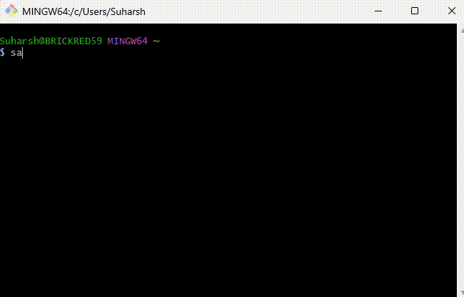

# Shelly-AI

A command-line interface for interacting with AI models (GPT-4o, Claude, Deepseek, etc) via OpenRouter.


It's available on npmjs.com at https://www.npmjs.com/package/shelly-ai 
 
## Features

- Interactive chat with AI models
- One-time query mode
- Automatic command detection and execution
- Configuration wizard
- Model selection from popular models.
- File context support (analyze code, documents, etc.)
- Conversation history management


## Easy install

Firstly you will need API keys from [Openrouter](https://openrouter.ai/settings/keys)
```bash
npm install -g shelly-ai

```
Then run
```bash
shelly-ai --setup

or

sa --setup
```

Paste your API key that you obtained from https://openrouter.ai/settings/keys here, and select a model of your choice.

## Installation from code

```bash
# Clone the repository
git clone https://github.com/yourusername/shelly-ai.git
cd shelly-ai

# Install dependencies
npm install

# Install globally (optional)
npm install -g .
```

## Setup

First, run the setup wizard to configure your API key and preferred model:

```bash
shelly-ai --setup
```

Or use the shorthand:

```bash
sa --setup
```

## Usage

### Interactive Chat

```bash
# Start an interactive chat
sa
```

### One-time Query

```bash
# Ask a question without starting interactive mode
sa "How do I list all Docker containers?"

# Ask a question and continue in interactive mode
sa --continue "How do I list all Docker containers?"
```

### File Context

```bash
# Analyze a file
sa -f ./myfile.js "Can you explain this code?"
```


```bash
# Analyze multiple files
sa -f ./myfile.js ./otherfile.txt "What do these files do?"

# Just analyze files without a specific question
sa -f ./myfile.js ./otherfile.txt

# Important: Always use quotes around your query when using file context
sa -f ./myfile.js "What does this file do?"    # CORRECT
sa -f ./myfile.js What does this file do?      # INCORRECT - will parse words as filenames
```

### Command Execution

```bash
# Auto-execute any commands suggested by the assistant
sa --execute "How do I create a new directory in the current folder?"
```

### Streaming

By default, responses are streamed in real-time for a more interactive experience:

```bash
# Streaming is enabled by default
sa "Tell me about Node.js"

# Explicitly enable streaming
sa --stream "Tell me about Node.js"

# Disable streaming
sa --no-stream "Tell me about Node.js"
```

Streaming shows the model's response word by word as it's being generated, which provides a more interactive experience.

### Other Options

```bash
# List available models
sa --list-models

# Specify a model to use
sa --model anthropic/claude-3.5-sonnet

# Set response temperature (0-1)
sa --temperature 0.8

# Clear conversation history
sa --clear
```

## Chat Commands

Within interactive chat mode, you can use these commands:

- `.exit` - Exit the chat
- `.clear` - Clear conversation history
- `.help` - Show help message
- `.model [modelId]` - Change model (leave blank to list available models)
- `.temp [0-1]` - Change temperature (0 = deterministic, 1 = creative)
- `.save [filename]` - Save conversation to file
- `.continue` - Continue generating from last response
- `.history` - Show conversation history
- `.file [path]` - Load a file as context

## License

MIT